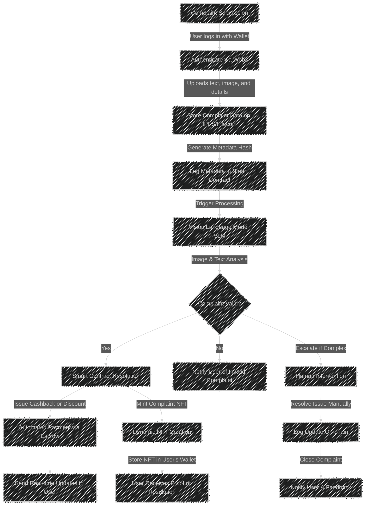

```mermaid
---
config:

  look: handDrawn
  theme: dark
---
graph TD
    A[Complaint Submission] -->|User logs in with Wallet| B[Authenticate via Web3];
    B -->|Uploads text, image, and details| C[Store Complaint Data on IPFS/Filecoin];
    C -->|Generate Metadata Hash| D[Log Metadata in Smart Contract];
    
    D -->|Trigger Processing| E[Vision Language Model VLM];
    E -->|Image & Text Analysis| F{Complaint Valid?};
    
    F -->|Yes| G[Smart Contract Resolution];
    F -->|No| H[Notify User of Invalid Complaint];
    
    G -->|Issue Cashback or Discount| I[Automated Payment via Escrow];
    G -->|Mint Complaint NFT| J[Dynamic NFT Creation];
    
    J -->|Store NFT in User's Wallet| K[User Receives Proof of Resolution];
    I --> L[Send Real-time Updates to User];
    
    F -->|Escalate if Complex| M[Human Intervention];
    M -->|Resolve Issue Manually| N[Log Update On-chain];
    
    N -->|Close Complaint| O[Notify User & Feedback]
```
